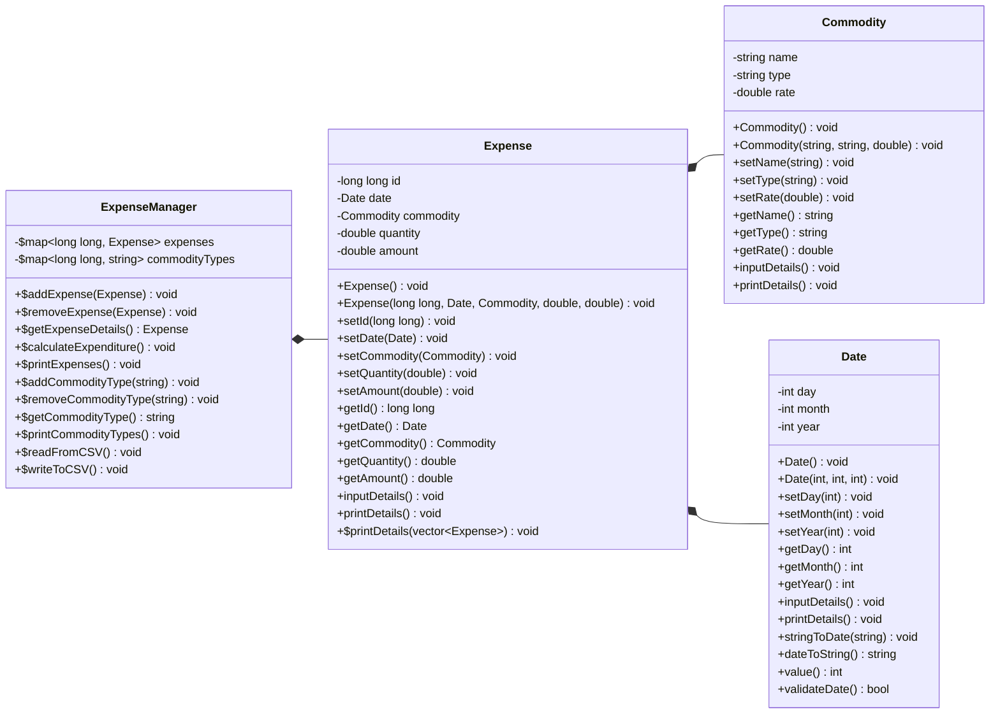

# expense-manager &nbsp; [](https://github.com/code-chaser/expense-manager/blob/main/LICENSE) [](https://github.com/code-chaser/expense-manager/archive/refs/heads/main.zip)
a simple tool that can be used to keep track of daily household expenses, made using basic OOPs features in C++ and a little bit of file handling
___

<!--
<table align="center" style="width:100%">
   <thead></thead>
   <tbody>
      <tr>
         <td rowspan=4><h3>CHECK OUT</h3></td>
         <td><a href="#build--execute">BUILD & EXECUTE</a></td>
      </tr>
      <tr>
         <td><a href="#screenshots">SCREENSHOTS</a></td>
      </tr>
      <tr>
         <td><a href="#class-design">CLASS DESIGN</a></td>
      </tr>
      <tr>
         <td><a href="#tech-stack">TECH STACK</a></td>
      </tr>
   </tbody>
</table>

___
-->


### CHECK OUT
- [BUILD & EXECUTE](#build--execute)
- [SCREENSHOTS](#screenshots)
- [CLASS DESIGN](#class-design)
- [TECH STACK](#tech-stack)

___

<br>


## BUILD & EXECUTE
- For Windows users: firstly install ` make ` for executing ` makefile `, from this [link](https://stackoverflow.com/questions/32127524/how-to-install-and-use-make-in-windows);
- For Linux users: ` make ` generally comes pre-installed;
   - if not, then run the following command: ` sudo apt-get install make `
   <br>
- Now, run the following commands:
   - for building executable file: 
  ```bash
     make all        # universal;
  ```
   - for executing it:
  ```bash
     make run        # universal;
  ```
   - for deleting executable file:
  ```bash
     make clean      # for linux/macOS;
     make clean(win) # for windows;
  ```
___

<br>

## SCREENSHOTS

<br>

<div style="text-align:center"></div>

<br>

<div style="text-align:center"></div>

<br>

<div style="text-align:center"></div>

<br>


___

<br>


## CLASS DESIGN


___

<br>

## CLASS DESIGN
   ***- rendered by [mermaid](https://mermaid-js.github.io/mermaid/#/classDiagram)***




___
### TECH STACK
- C++

___
> #### _Happy Expenditures!! 🤪_
___
